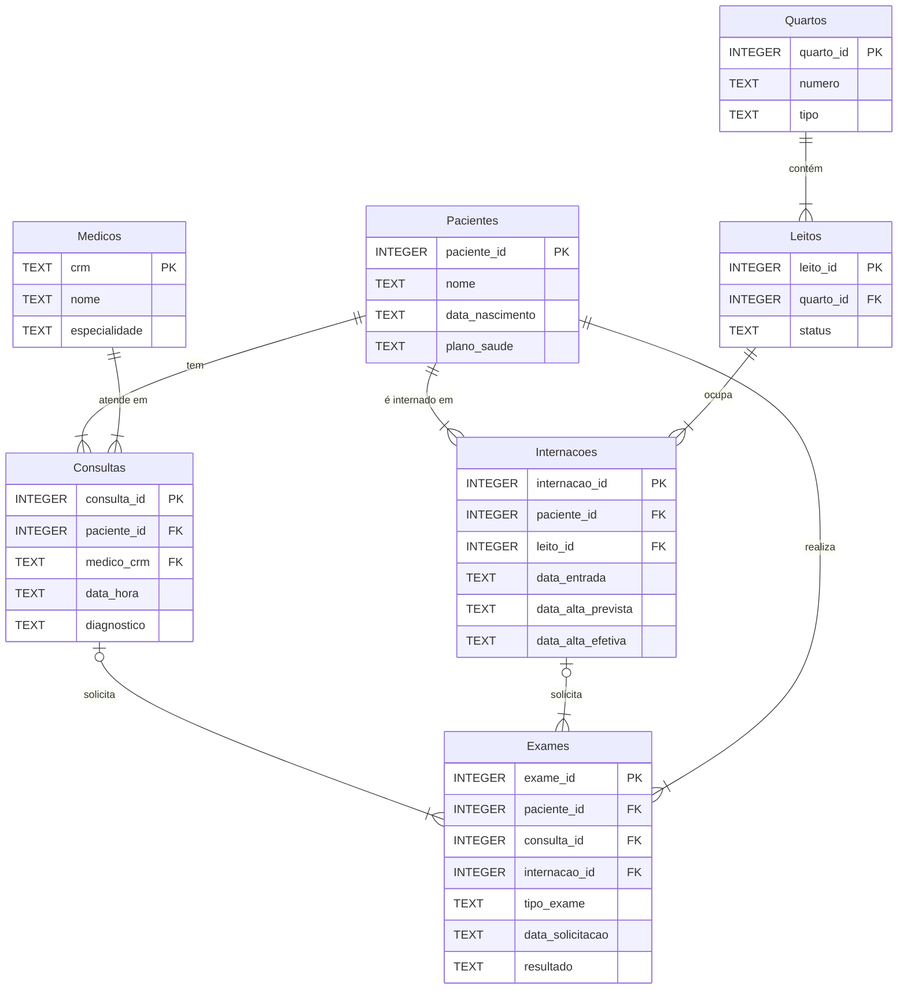

# Diagrama MER - Sistema Hospitalar Completo

## Entidades

- **Pacientes**: Cadastro dos pacientes com informações pessoais e plano de saúde
- **Medicos**: Registro dos médicos com CRM e especialidade
- **Quartos**: Estrutura física do hospital (apartamento ou enfermaria)
- **Leitos**: Camas individuais dentro dos quartos com controle de status
- **Consultas**: Atendimentos ambulatoriais conectando paciente e médico
- **Internacoes**: Períodos de hospitalização dos pacientes
- **Exames**: Solicitações e resultados de exames diagnósticos

## Relacionamentos

- Um **Paciente** pode ter múltiplas **Consultas**, **Internacoes** e **Exames** (relacionamento 1:N)
- Um **Medico** pode realizar múltiplas **Consultas** (relacionamento 1:N)
- Um **Quarto** contém múltiplos **Leitos** (relacionamento 1:N)
- Um **Leito** pode ser ocupado por múltiplas **Internacoes** ao longo do tempo (relacionamento 1:N)
- **Consultas** e **Internacoes** podem solicitar múltiplos **Exames** (relacionamento 1:N)

## Características Avançadas

- **Gestão de Leitos**: Status controlado ('Livre', 'Ocupado', 'Manutenção') garante disponibilidade
- **Ramificação de Exames**: Um exame pode estar ligado a uma consulta OU a uma internação:
  - Se `consulta_id` está preenchido, `internacao_id` é NULL
  - Se `internacao_id` está preenchido, `consulta_id` é NULL
  - Constraint CHECK garante essa exclusividade
- **Integração de Subdomínios**: O modelo unifica ambulatorial (consultas) e hospitalar (internações) em um único sistema coeso
- **Fluxo Completo do Paciente**: Rastreia toda a jornada desde consulta até alta, incluindo todos os exames realizados
- Este é o modelo mais complexo, demonstrando integração de múltiplos processos de negócio em um sistema hospitalar completo