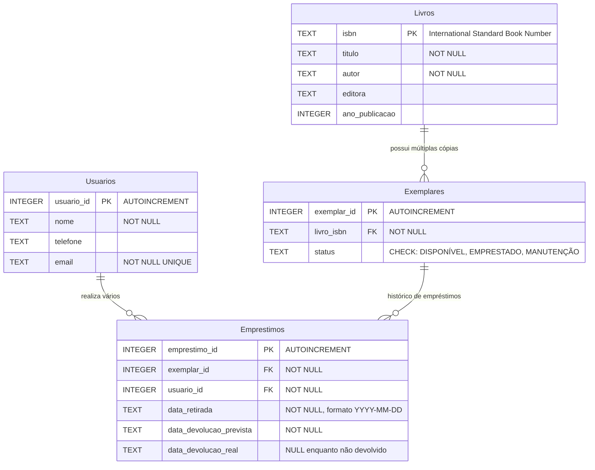

# Diagrama MER - Sistema Básico de Biblioteca

**Contexto:** Sistema Básico de Biblioteca (Baixa Complexidade)  
**Objetivo:** Controlar livros, exemplares físicos, usuários e empréstimos  
**Autores:** Gabriel Freitas Souza, Roberli Schuina Silva  

---

## 🗺️ Diagrama MER (Modelo Entidade-Relacionamento)



---

## 📋 Descrição das Entidades

### 📖 **Livros**
**Propósito:** Armazena informações bibliográficas compartilhadas entre exemplares

**Atributos:**
- `isbn` (PK): Código internacional padrão do livro - identificação única
- `titulo`: Nome da obra - campo obrigatório
- `autor`: Nome do autor ou autores principais - campo obrigatório
- `editora`: Casa editorial responsável pela publicação
- `ano_publicacao`: Ano de publicação da edição

**Regras de Negócio:**
- Cada livro é identificado unicamente pelo ISBN
- Título e autor são campos obrigatórios
- Um livro pode ter várias cópias físicas (exemplares)

### 📄 **Exemplares**
**Propósito:** Representa cada cópia física individual de um livro

**Atributos:**
- `exemplar_id` (PK): Identificador único autoincremento
- `livro_isbn` (FK): Referência ao livro - campo obrigatório
- `status`: Estado atual do exemplar - valores controlados

**Valores de Status:**
- `DISPONÍVEL`: Exemplar disponível para empréstimo
- `EMPRESTADO`: Exemplar atualmente emprestado
- `MANUTENÇÃO`: Exemplar em manutenção ou reparo

### 👥 **Usuarios**
**Propósito:** Cadastro de membros da biblioteca

**Atributos:**
- `usuario_id` (PK): Identificador único autoincremento
- `nome`: Nome completo do usuário - campo obrigatório
- `telefone`: Número de contato - opcional
- `email`: Endereço eletrônico - obrigatório e único

### 📋 **Emprestimos**
**Propósito:** Registra transações de empréstimo entre usuários e exemplares

**Atributos:**
- `emprestimo_id` (PK): Identificador único da transação
- `exemplar_id` (FK): Exemplar emprestado - obrigatório
- `usuario_id` (FK): Usuário que pegou emprestado - obrigatório
- `data_retirada`: Data/hora da retirada - formato ISO 8601
- `data_devolucao_prevista`: Prazo para devolução
- `data_devolucao_real`: Data efetiva da devolução (NULL se não devolvido)

---

## 🔗 Relacionamentos e Cardinalidades

### **Livros ↔ Exemplares (1:N)**
- **Cardinalidade:** Um livro possui zero ou muitos exemplares
- **Descrição:** Permite que um mesmo livro tenha múltiplas cópias físicas
- **Chave Estrangeira:** `Exemplares.livro_isbn` referencia `Livros.isbn`

### **Usuarios ↔ Emprestimos (1:N)**
- **Cardinalidade:** Um usuário pode ter zero ou muitos empréstimos
- **Descrição:** Permite histórico completo de empréstimos por usuário
- **Chave Estrangeira:** `Emprestimos.usuario_id` referencia `Usuarios.usuario_id`

### **Exemplares ↔ Emprestimos (1:N)**
- **Cardinalidade:** Um exemplar pode ter zero ou muitos empréstimos
- **Descrição:** Mantém histórico temporal de uso de cada exemplar
- **Chave Estrangeira:** `Emprestimos.exemplar_id` referencia `Exemplares.exemplar_id`

---

## 📊 Exemplos de Consultas Suportadas

```sql
-- Exemplares disponíveis de um livro específico
SELECT e.exemplar_id, l.titulo, l.autor
FROM Exemplares e
JOIN Livros l ON e.livro_isbn = l.isbn
WHERE e.status = 'DISPONÍVEL' AND l.isbn = '978-123-456-789';

-- Histórico de empréstimos de um usuário
SELECT l.titulo, e.data_retirada, e.data_devolucao_prevista, e.data_devolucao_real
FROM Emprestimos e
JOIN Exemplares ex ON e.exemplar_id = ex.exemplar_id
JOIN Livros l ON ex.livro_isbn = l.isbn
WHERE e.usuario_id = 1
ORDER BY e.data_retirada DESC;

-- Exemplares em atraso
SELECT u.nome, l.titulo, e.data_devolucao_prevista
FROM Emprestimos e
JOIN Usuarios u ON e.usuario_id = u.usuario_id
JOIN Exemplares ex ON e.exemplar_id = ex.exemplar_id
JOIN Livros l ON ex.livro_isbn = l.isbn
WHERE e.data_devolucao_real IS NULL 
  AND DATE(e.data_devolucao_prevista) < DATE('now');
```

---

## ✅ Validações Implementadas

- **Primary Keys:** Garantem unicidade de registros
- **Foreign Keys:** Garantem integridade referencial  
- **CHECK Constraints:** Status controlado dos exemplares
- **UNIQUE Constraints:** E-mail único por usuário
- **NOT NULL Constraints:** Campos obrigatórios
- **Validação de Datas:** Formato correto garantido

---

## 🚀 Extensões Futuras Possíveis

- **Sistema de Reservas** para exemplares indisponíveis
- **Sistema de Multas** por atraso na devolução
- **Categorias/Gêneros** de livros para melhor organização
- **Sistema de Renovação** de empréstimos
- **Auditoria e Log** de operações do sistema

---

**Complexidade:** Baixa - ideal para aprendizado  
**Normalização:** 3FN (Terceira Forma Normal)  
**Última atualização:** Outubro 2025