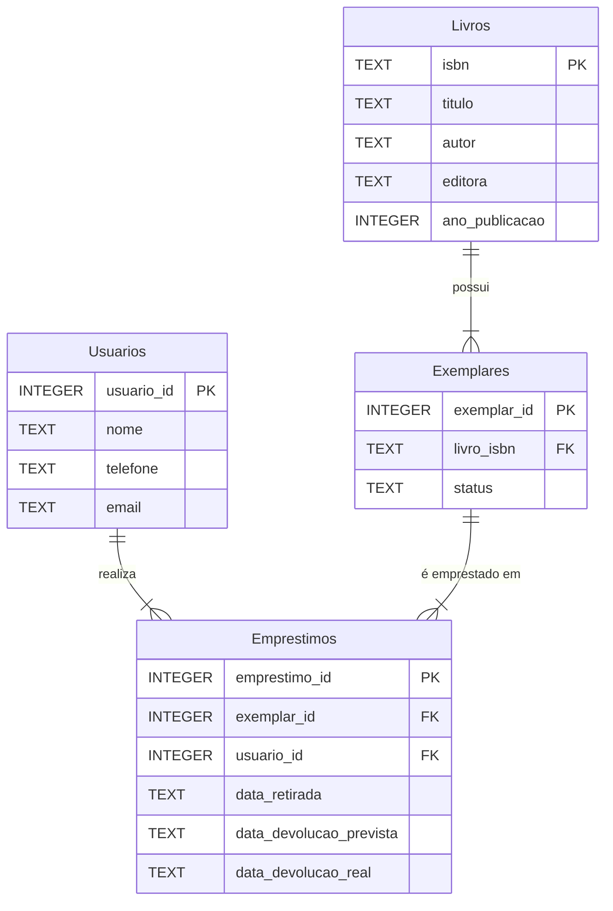

# Diagrama MER - Sistema Básico de Biblioteca

## Entidades

- **Livros**: Armazena as informações bibliográficas que são comuns a todas as cópias de uma obra (ISBN, título, autor, editora, ano de publicação)
- **Exemplares**: Representa cada cópia física única de um livro, permitindo rastrear o status individual de cada exemplar
- **Usuarios**: Representa os membros da biblioteca com suas informações de contato
- **Emprestimos**: Registra as transações de empréstimo, conectando um usuário a um exemplar específico

## Relacionamentos

- Um **Livro** pode ter múltiplos **Exemplares** (relacionamento 1:N)
- Um **Usuario** pode realizar múltiplos **Emprestimos** (relacionamento 1:N)
- Um **Exemplar** pode estar em múltiplos **Emprestimos** ao longo do tempo (relacionamento 1:N)
- O sistema permite rastrear o histórico completo de empréstimos através das datas de retirada e devolução