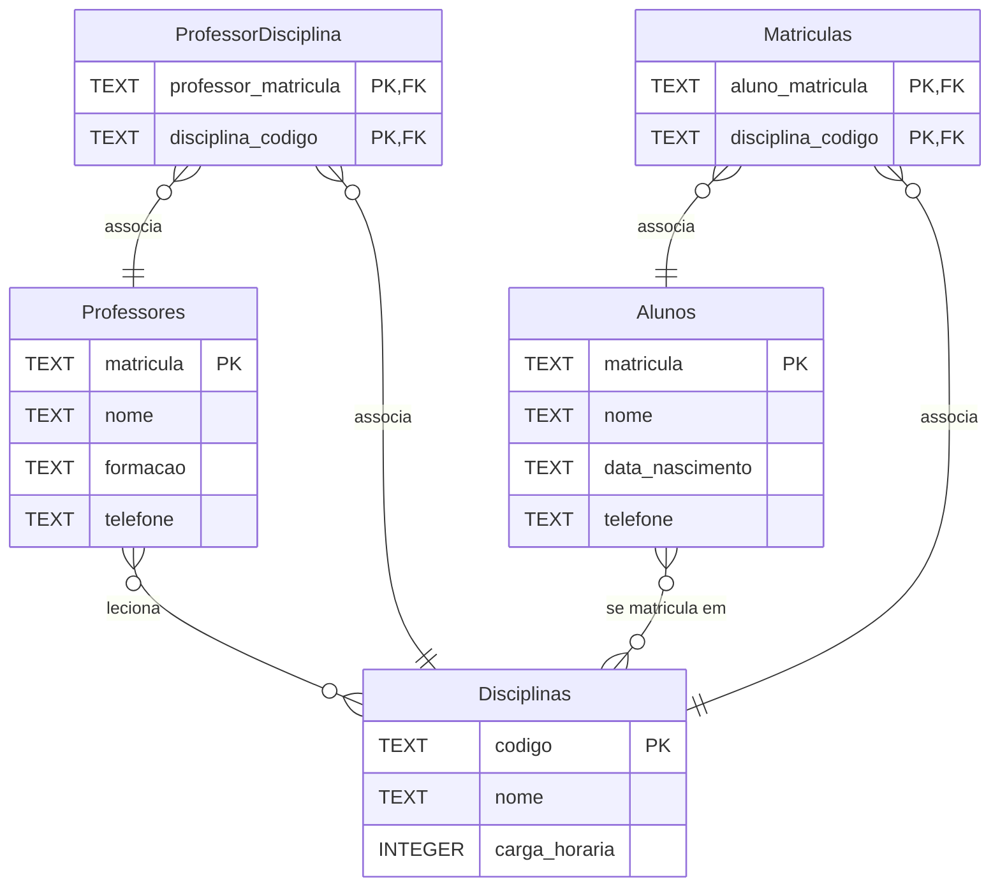

# Diagrama MER - Controle Acadêmico Simplificado

## Entidades

- **Alunos**: Armazena informações dos estudantes (matrícula, nome, data de nascimento, telefone)
- **Professores**: Contém dados dos docentes incluindo formação acadêmica
- **Disciplinas**: Cadastro das disciplinas oferecidas com carga horária
- **ProfessorDisciplina**: Tabela de junção que resolve o relacionamento N:M entre professores e disciplinas
- **Matriculas**: Tabela de junção que resolve o relacionamento N:M entre alunos e disciplinas

## Relacionamentos

- Um **Professor** pode lecionar várias **Disciplinas**, e uma **Disciplina** pode ser lecionada por vários **Professores** (relacionamento N:M)
- Um **Aluno** pode se matricular em várias **Disciplinas**, e uma **Disciplina** pode ter vários **Alunos** matriculados (relacionamento N:M)
- As tabelas de junção **ProfessorDisciplina** e **Matriculas** implementam esses relacionamentos muitos-para-muitos
- Este modelo permite flexibilidade no planejamento acadêmico, onde professores podem compartilhar turmas e alunos podem cursar múltiplas disciplinas