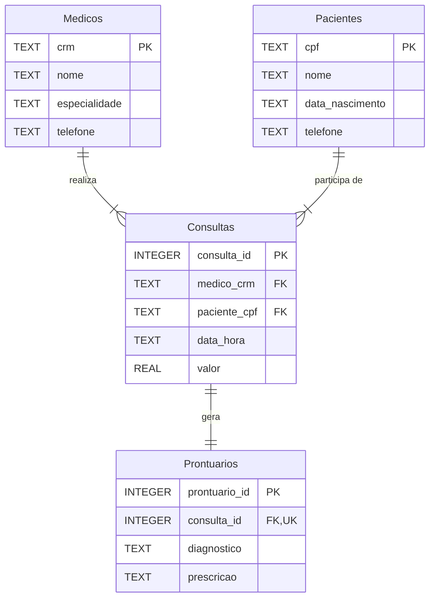

# Diagrama MER - Clínica Médica

## Entidades

- **Medicos**: Cadastro dos médicos da clínica com CRM, nome, especialidade e contato
- **Pacientes**: Informações dos pacientes incluindo CPF, nome, data de nascimento e telefone
- **Consultas**: Registro do agendamento e realização das consultas, conectando médico e paciente
- **Prontuarios**: Registro formal do diagnóstico e prescrição resultante de cada consulta

## Relacionamentos

- Um **Medico** pode realizar múltiplas **Consultas** (relacionamento 1:N)
- Um **Paciente** pode participar de múltiplas **Consultas** (relacionamento 1:N)
- Uma **Consulta** gera exatamente um **Prontuario**, e cada **Prontuario** pertence a uma única **Consulta** (relacionamento 1:1)
- A constraint UNIQUE na chave estrangeira `consulta_id` da tabela Prontuarios garante a cardinalidade 1:1
- Este modelo reflete o processo de negócio: a consulta é agendada primeiro, e depois o prontuário é gerado como registro formal do atendimento