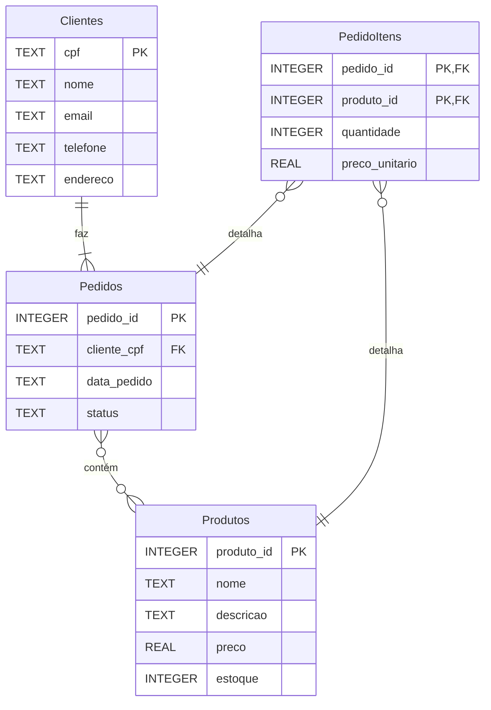

# Diagrama MER - E-commerce Básico

## Entidades

- **Clientes**: Cadastro dos compradores com informações pessoais e de contato
- **Produtos**: Catálogo de produtos com descrição, preço atual e quantidade em estoque
- **Pedidos**: Cabeçalho do pedido contendo informações gerais como data e status
- **PedidoItens**: Tabela de junção que detalha os produtos de cada pedido com atributos específicos

## Relacionamentos

- Um **Cliente** pode fazer múltiplos **Pedidos** (relacionamento 1:N)
- Um **Pedido** pode conter vários **Produtos**, e um **Produto** pode estar em vários **Pedidos** (relacionamento N:M)
- A tabela **PedidoItens** implementa o relacionamento N:M com atributos adicionais:
  - `quantidade`: quantidade do produto neste pedido específico
  - `preco_unitario`: preço do produto no momento da compra (preserva histórico mesmo se o preço mudar)
- Este padrão de "relacionamento N:M com atributos" é essencial para sistemas transacionais, garantindo integridade histórica dos dados