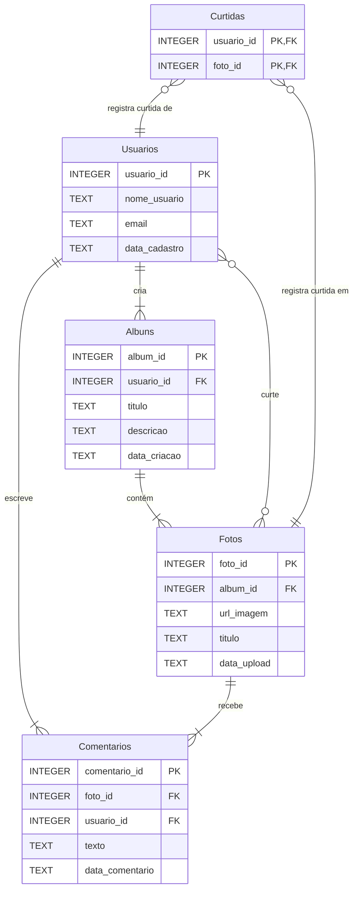

# Diagrama MER - Rede Social de Fotos

## Entidades

- **Usuarios**: Perfis dos usuários da rede social com nome de usuário único e email
- **Albuns**: Coleções de fotos organizadas por usuário com título e descrição
- **Fotos**: Imagens armazenadas com URL, título e data de upload
- **Comentarios**: Textos associados às fotos por usuários com timestamp
- **Curtidas**: Tabela de junção simples para o relacionamento N:M entre usuários e fotos

## Relacionamentos

- Um **Usuario** pode criar múltiplos **Albuns** (relacionamento 1:N)
- Um **Album** pode conter múltiplas **Fotos** (relacionamento 1:N)
- Um **Usuario** pode escrever múltiplos **Comentarios**, e uma **Foto** pode receber múltiplos **Comentarios** (relacionamento N:M através da tabela Comentarios)
- Um **Usuario** pode curtir múltiplas **Fotos**, e uma **Foto** pode ser curtida por múltiplos **Usuarios** (relacionamento N:M através da tabela Curtidas)
- Este modelo demonstra múltiplos relacionamentos N:M entre as mesmas entidades (Usuario e Foto), cada um servindo a um propósito diferente (comentar vs curtir)