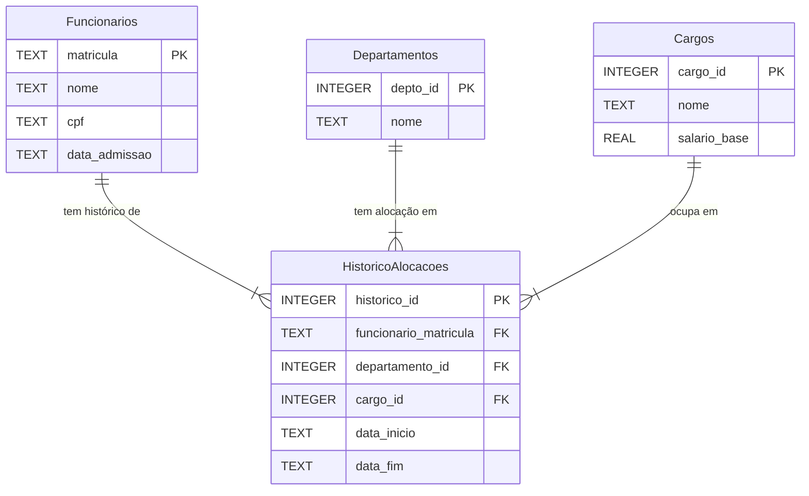

# Diagrama MER - Sistema de RH

## Entidades

- **Funcionarios**: Dados pessoais e de admissão dos colaboradores
- **Departamentos**: Lista de departamentos da empresa
- **Cargos**: Catálogo de cargos com seus respectivos salários base
- **HistoricoAlocacoes**: Tabela de associação temporal que registra a carreira do funcionário

## Relacionamentos

- Um **Funcionario** pode ter múltiplas entradas no **HistoricoAlocacoes** ao longo de sua carreira (relacionamento 1:N)
- Um **Departamento** pode ter múltiplos funcionários ao longo do tempo no **HistoricoAlocacoes** (relacionamento 1:N)
- Um **Cargo** pode ser ocupado por múltiplos funcionários ao longo do tempo no **HistoricoAlocacoes** (relacionamento 1:N)
- A tabela **HistoricoAlocacoes** implementa um padrão de "dados temporais" que permite:
  - Rastrear transferências de departamento
  - Registrar promoções e mudanças de cargo
  - Manter histórico completo da carreira do funcionário
  - `data_fim` fica NULL para a alocação atual
- Este modelo preserva todo o histórico profissional sem perder dados quando ocorrem mudanças organizacionais