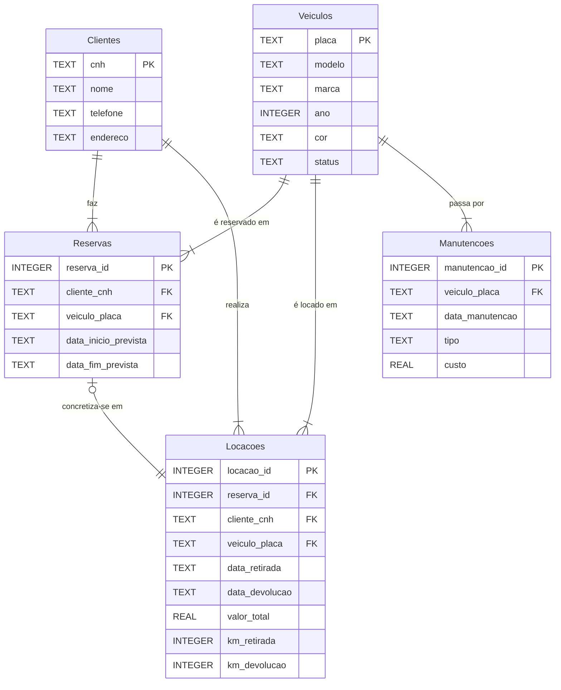

# Diagrama MER - Locadora de Veículos

## Entidades

- **Clientes**: Armazena os dados dos clientes da locadora, incluindo CNH, nome e informações de contato.
- **Veiculos**: Contém as informações sobre os veículos da frota, como placa, modelo, marca e status (Disponível, Locado, Em Manutenção).
- **Reservas**: Registra as reservas de veículos feitas pelos clientes para datas futuras.
- **Locacoes**: Armazena o histórico de locações de veículos, incluindo datas, valores e quilometragem de retirada e devolução.
- **Manutencoes**: Mantém o registro de manutenções realizadas nos veículos.

## Relacionamentos

-   **Clientes e Reservas/Locações (1:N)**: Um cliente pode realizar múltiplas reservas e locações. Isso é representado pelas chaves estrangeiras `cliente_cnh` nas tabelas `Reservas` e `Locacoes`.
-   **Veículos e Reservas/Locações/Manutenções (1:N)**: Um veículo pode estar associado a múltiplas reservas, locações e manutenções ao longo do tempo. Representado pelas chaves estrangeiras `veiculo_placa` nas tabelas `Reservas`, `Locacoes` e `Manutencoes`.
-   **Reservas e Locações (1:1 opcional)**: Uma reserva pode ser convertida em, no máximo, uma locação. A chave estrangeira `reserva_id` na tabela `Locacoes` possui uma restrição `UNIQUE` para garantir essa cardinalidade.