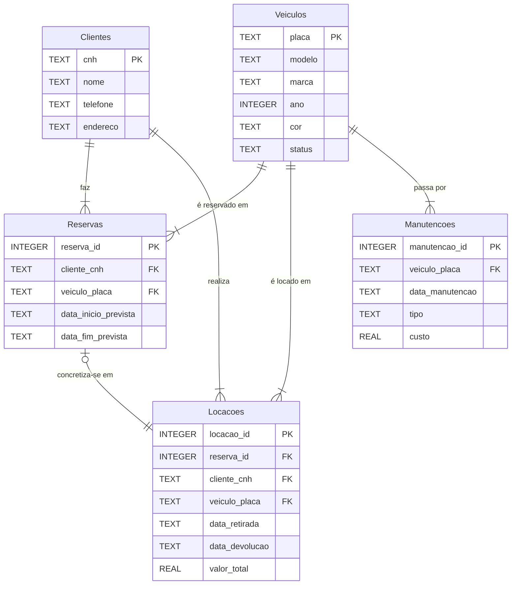

# Diagrama MER - Locadora de Veículos

## Entidades

- **Clientes**: Cadastro dos locatários com CNH, nome e informações de contato
- **Veiculos**: Frota de veículos com dados de identificação e status operacional
- **Reservas**: Agendamento de futuras locações com datas previstas
- **Locacoes**: Registro de locações efetivadas com quilometragem e valores
- **Manutencoes**: Histórico de manutenções realizadas nos veículos

## Relacionamentos

- Um **Cliente** pode fazer múltiplas **Reservas** e **Locacoes** (relacionamento 1:N)
- Um **Veiculo** pode estar em múltiplas **Reservas**, **Locacoes** e **Manutencoes** ao longo do tempo (relacionamento 1:N)
- Uma **Reserva** pode se concretizar em no máximo uma **Locacao** (relacionamento 1:1 opcional)
- O campo `status` em **Veiculos** gerencia o ciclo de vida: 'Disponível', 'Locado', 'Em Manutenção'
- Este modelo complexo permite:
  - Gerenciar reservas futuras
  - Rastrear histórico completo de locações por veículo e cliente
  - Manter registro de manutenções preventivas e corretivas
  - Controlar disponibilidade da frota em tempo real