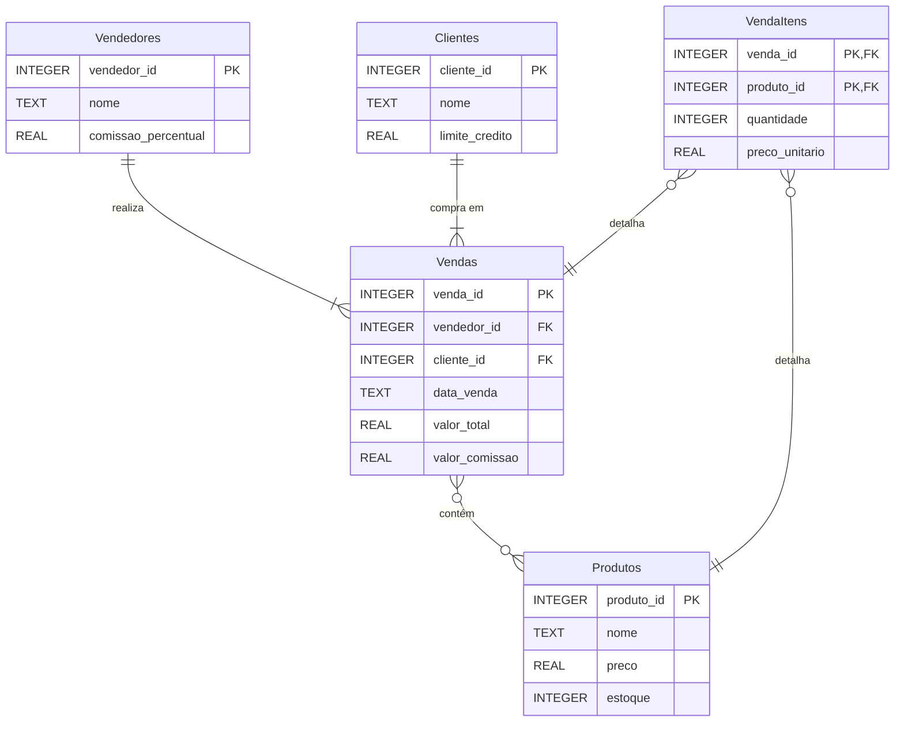

# Diagrama MER - Sistema de Vendas com Vários Vendedores

## Entidades

- **Vendedores**: Cadastro dos vendedores com seus percentuais de comissão
- **Clientes**: Informações dos clientes incluindo limite de crédito
- **Produtos**: Catálogo de produtos com preço atual e estoque disponível
- **Vendas**: Cabeçalho da venda conectando vendedor e cliente, com valores totais
- **VendaItens**: Detalhamento dos produtos vendidos com quantidade e preço unitário

## Relacionamentos

- Um **Vendedor** pode realizar múltiplas **Vendas** (relacionamento 1:N)
- Um **Cliente** pode comprar em múltiplas **Vendas** (relacionamento 1:N)
- Uma **Venda** pode conter vários **Produtos**, e um **Produto** pode estar em várias **Vendas** (relacionamento N:M)
- A tabela **VendaItens** implementa o relacionamento N:M com atributos de transação
- Recursos avançados:
  - `valor_comissao` é armazenado na venda (não calculado dinamicamente) para garantir integridade histórica
  - Mesmo que a taxa de comissão do vendedor mude no futuro, vendas antigas mantêm seus valores originais
  - `preco_unitario` preserva o preço no momento da venda, independente de alterações futuras no catálogo
- Este padrão é essencial para sistemas financeiros onde a imutabilidade dos registros históricos é crítica