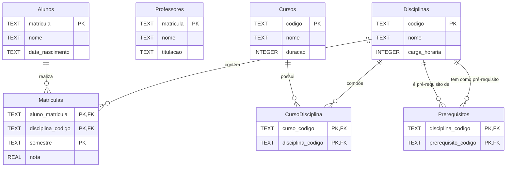

# Diagrama MER - Sistema de Matrícula em Universidade

## Entidades

- **Alunos**: Cadastro dos estudantes da universidade
- **Professores**: Cadastro de professores da universidade
- **Cursos**: Programas acadêmicos oferecidos pela universidade com duração em semestres
- **Disciplinas**: Componentes curriculares com carga horária definida
- **Matriculas**: Tabela de junção que registra alunos matriculados em disciplinas com notas e semestre
- **CursoDisciplina**: Tabela de junção que define o currículo de cada curso
- **Prerequisitos**: Tabela de junção para auto-relacionamento de disciplinas (dependências curriculares)

## Relacionamentos

- Um **Aluno** pode realizar várias **Matriculas**, mas cada **Matricula** é de um único **Aluno**.
- Uma **Disciplina** pode estar contida em várias **Matriculas**, e cada **Matricula** é de uma única **Disciplina**.
- Um **Curso** pode possuir várias **Disciplinas** em sua grade, e uma **Disciplina** pode compor a grade de vários **Cursos** (relacionamento N:M via CursoDisciplina).
- Uma **Disciplina** pode ter outra como pré-requisito (auto-relacionamento N:M via Prerequisitos).
- Recursos avançados:
  - **Auto-relacionamento**: A tabela Prerequisitos relaciona Disciplinas com elas mesmas, permitindo definir dependências curriculares
  - `disciplina_codigo` → disciplina que POSSUI o pré-requisito
  - `prerequisito_codigo` → disciplina que É o pré-requisito
  - A tabela **Matriculas** inclui `semestre` para diferenciar múltiplas tentativas da mesma disciplina
- Este modelo complexo suporta gestão acadêmica completa incluindo validação de pré-requisitos e histórico escolar detalhado